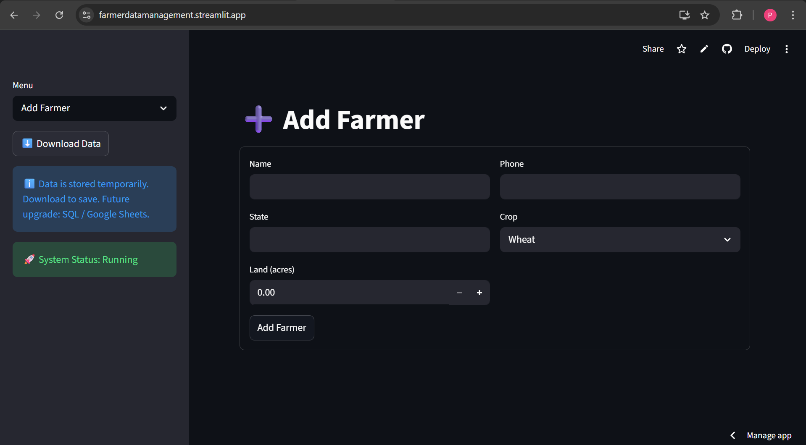
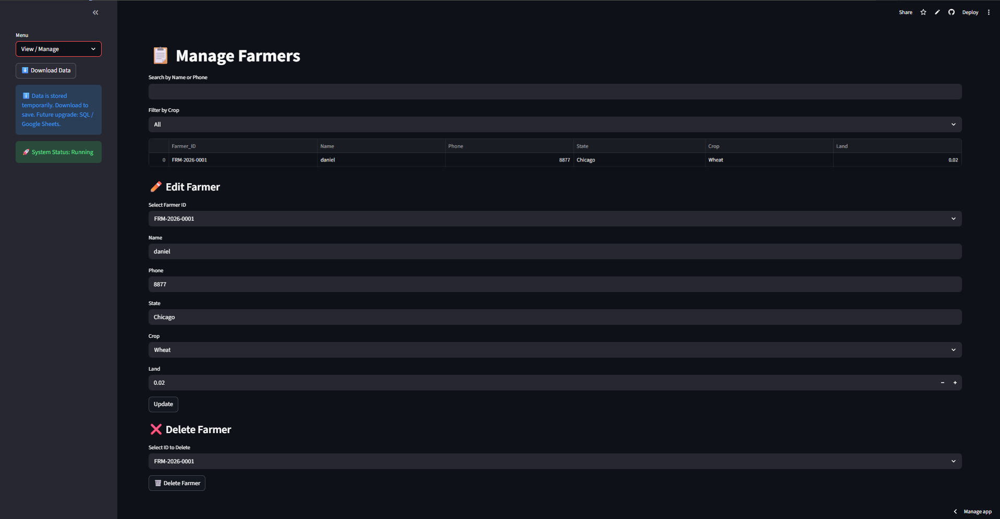
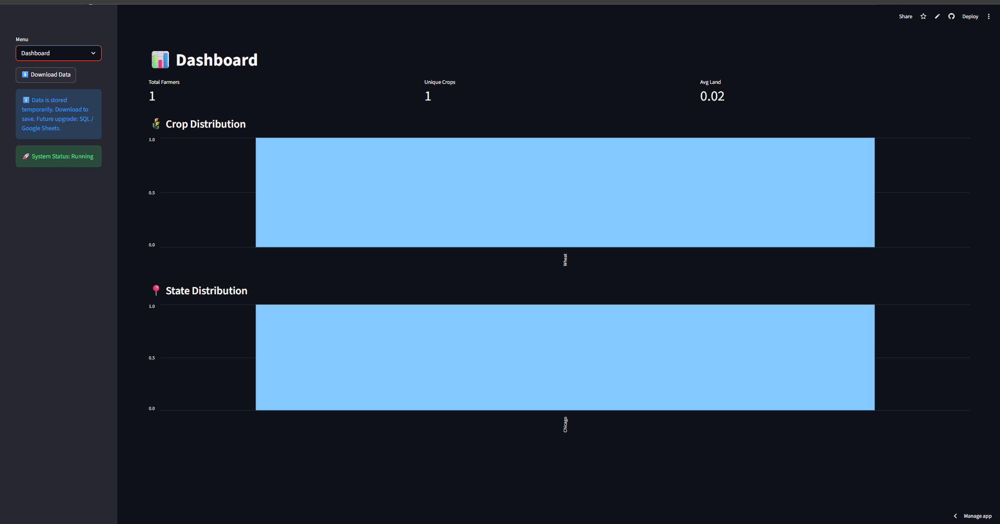

# 🌾 Farmer Data Management & Tracking System

A web-based data management system built to streamline farmer onboarding, data tracking, and basic analytics. This project simulates real-world agri-tech workflows by managing structured farmer data with validation, unique ID generation, and interactive dashboards.

---

## 🚀 Live Demo
👉 [Farmer Data Management Tracking System](https://farmerdatamanagement.streamlit.app/)





---

## 📌 Features

- 📥 Farmer onboarding with structured data entry forms  
- 🆔 Automated unique Farmer ID generation  
- ✅ Data validation (phone number, required fields, etc.)  
- 📊 Interactive dashboard with key metrics  
- 📂 CSV-based data storage and download option  
- ⚡ Smooth UI with loading states and toast notifications  

---

## 🧠 Tech Stack

**Farmer Data Management System | Python, Streamlit, Pandas, NumPy, HTML/CSS**

---

## 🏗️ Project Structure
│── app.py # Main Streamlit app

│── utils/
      - analytics.py
      - data_cleaning.py
      - id_generator.py
      - validation.py
      
│── requirements.txt # Dependencies

│── README.md

---

## ⚙️ Installation & Setup

1. Clone the repository

```bash
git clone https://github.com/your-username/farmer-data-management.git
cd farmer-data-management
 ```
2. Install dependencies
 ```bash
pip install -r requirements.txt
``` 
3. Run the app
   ``` bash
   streamlit run app.py
   ```


⚠️ Note on Data Storage
Currently, the system uses CSV-based storage, which is temporary in deployed environments
Users are encouraged to download data for persistence

👉 Future Improvements:

Integration with SQL databases (MySQL/PostgreSQL)
Google Sheets API for cloud-based storage
Multi-user authentication system

📈 Future Enhancements
🔐 Admin login & authentication
🌐 Cloud database integration
📊 Advanced analytics & visualizations
🔄 Real-time data updates
📱 Mobile-friendly UI
🎯 Use Case

This project is designed to simulate:

Agri-tech data workflows
Farmer onboarding systems
Supply chain data tracking
Scalable data management solutions
